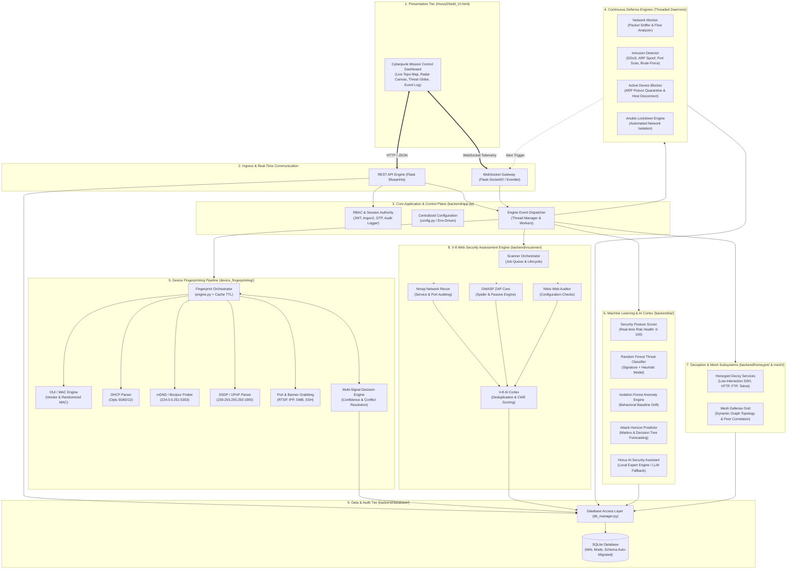
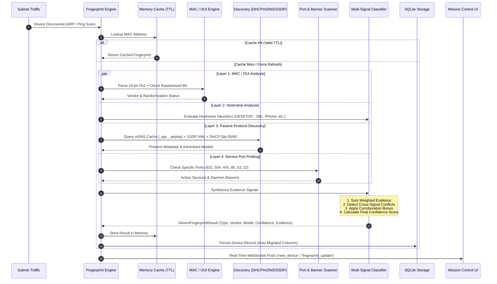
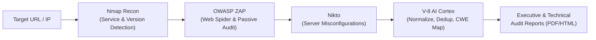

# HorusShield 2.0 — Egyptian AI Cybersecurity Platform
### Developed by Team NullByte · Alexandria, Egypt 🇪🇬

[](https://www.python.org/)
[](LICENSE)
[]()
[]()
[-brightgreen.svg)]()

---

## 🏛️ Executive Summary

**HorusShield 2.0** is an enterprise-grade, local-first cybersecurity defense and assessment platform. Designed as a unified defense ecosystem, HorusShield couples passive deep packet inspection, automated intrusion detection, and active threat neutralization with an offline-first **Machine Learning Suite**, an **Active Deception Subsystem (Honeypots & Mesh Defense)**, a **Multi-Signal Device Fingerprinting Pipeline**, and the **V-8 Web Security Scanner** (orchestrating OWASP ZAP, Nikto, and Nmap).

HorusShield executes seamlessly across three operational environments from a single unified codebase:
1. **Native Windows Desktop Application** (`.exe` via PyInstaller + `pywebview`)
2. **Containerized Linux Microservice** (Docker / Docker Compose with Linux kernel net-caps)
3. **Local Python CLI / Source Runtime** (cross-platform development runtime)

---

## 📐 High-Level Architecture Overview

HorusShield 2.0 is built on an **Asynchronous Event-Driven Micro-Engine Architecture**. The frontend communicates over a dual-channel boundary (RESTful HTTP for transactional state changes and bidirectional WebSockets for sub-second telemetry and attack alerts).



---

## 🔬 Core Architectural Subsystems

### 1. Device Identification & Fingerprinting Pipeline
The Device Fingerprinting Engine replaces generic "Unknown" markers with canonical hardware classifications without sending network data to third-party cloud APIs.



#### Canonical Device Taxonomy (22 Categories)
| Category | Primary Corroborating Signals | Default Icon |
| :--- | :--- | :---: |
| **Windows PC** | `DESKTOP-` / `WIN-` hostname, SMB (445), RDP (3389), Microsoft HTTP | 💻 |
| **Windows Laptop** | `LAPTOP-` hostname, Wi-Fi adapter OUI, Windows services | 💻 |
| **Linux PC / Server** | Linux kernel banners, OpenSSH, Dropbear, Avahi mDNS | 💻 / 🖥️ |
| **macOS Computer** | Mac model string (`MacBook`, `iMac`), Apple OUI, AirPlay, Bonjour | 💻 |
| **iPhone / iPad** | `iPhone` / `iPad` hostname, Apple OUI, AirPlay/RAOP, Apple DHCP Opt 55 | 📱 |
| **Android Phone / Tablet** | `Galaxy-S`, `SM-G` / `SM-X` (Tab), Android DHCP signatures | 📱 |
| **Smart TV** | UPnP `MediaRenderer`, Tizen/webOS banners, Chromecast / DIAL | 📺 |
| **Printer** | IPP (631), Raw JetDirect (9100), `_printer._tcp`, HP/Canon OUI | 🖨️ |
| **Router / Gateway** | Default Gateway IP, DHCP server (67), DNS (53), Web Admin (80/443) | 📡 / 🌐 |
| **Security Camera (IP Cam)**| RTSP (554), ONVIF metadata, Hikvision/Dahua/Axis OUI | 📷 |
| **NAS / Network Storage** | SMB/NFS ports, Synology/QNAP/TrueNAS HTTP banners | 🗄️ |
| **IoT / Embedded Device** | Espressif OUI, MQTT (1883), Tuya/Sonoff signatures | 🔌 |
| **Virtual Machine** | VMware/VirtualBox/QEMU OUI signatures | 🔲 |
| **Unknown Device** | Minimal or non-corroborated indicators (honestly labeled) | ❓ |

---

### 2. Multi-Tier AI / Machine Learning Engine
HorusShield avoids black-box unverified predictions by deploying focused, specialized models running locally on CPU via `scikit-learn` and `joblib`:

```
                 Incoming Packet / Flow / Alert Event
                                   │
      ┌────────────────────────────┼────────────────────────────┐
      ▼                            ▼                            ▼
┌───────────────┐          ┌───────────────┐          ┌───────────────────┐
│ Threat Clf    │          │ Anomaly Det   │          │ Attack Predictor  │
│ Random Forest │          │ Isol. Forest  │          │ Markov / Tree     │
└───────┬───────┘          └───────┬───────┘          └─────────┬─────────┘
        │ Classifies attack        │ Flags baseline             │ Forecasts next
        │ signature                │ deviation                  │ attack vector
        └──────────────────────────┼────────────────────────────┘
                                   │
                                   ▼
                   ┌───────────────────────────────┐
                   │  Overall Security Risk Scorer │
                   │  Calculates Network Health    │
                   │  Index (0 - 100%)             │
                   └───────────────┬───────────────┘
                                   │
                                   ▼
                   ┌───────────────────────────────┐
                   │  Horus AI Security Assistant  │
                   │  (Rule-Based Reasoning with   │
                   │   Claude API Extension)       │
                   └───────────────────────────────┘
```

1. **Threat Classifier** (`threat_classifier.joblib`): Random Forest classifier trained on network flow metrics (packet size variance, inter-arrival times, port frequencies, protocol ratios) to distinguish benign traffic from DDoS, Brute Force, and Port Scans.
2. **Behavioral Anomaly Detector** (`anomaly_detector.joblib`): Unsupervised Isolation Forest model mapping baseline subnet behavior and isolating abnormal connection spikes.
3. **Attack Horizon Predictor** (`attack_predictor.joblib`): Multi-stage forecasting engine predicting probable attacker progression (e.g., Reconnaissance $\rightarrow$ Exploitation).
4. **Security Health Scorer** (`backend/ai/security_scorer.py`): Deterministic weighted score synthesized from active threats, unmapped devices, open vulnerabilities, and honeypot triggers.
5. **Horus AI Assistant** (`backend/services/horus_ai.py`): Hybrid cybersecurity reasoning assistant featuring local rule-based incident analysis and optional Claude API integration.

---

### 3. Deception Subsystem: Honeypots & Mesh Defense
- **Low-Interaction Honeypots (`backend/honeypot/`)**: Emulates accessible network services across common attack vectors:
  - **SSH Decoy** (Port 2222 / 22): Emulates an OpenSSH banner; captures username/password brute-force attempts and records attacker sessions.
  - **HTTP Decoy** (Port 8080): Emulates an administrative login portal; intercepts web probes and vulnerability fuzzing.
  - **FTP Decoy** (Port 2121): Emulates vsftpd; monitors anonymous login abuse.
  - **Telnet Decoy** (Port 2323): Captures automated IoT botnet credential stuffing.
- **Mesh Defense Grid (`backend/mesh/`)**: Models the protected subnet as an interconnected network graph. When an intrusion is detected at any node, the graph dynamically recalculates centrality and spreads quarantine constraints to neighboring endpoints.

---

### 4. V-8 Web Application Security Scanner
The **V-8 Scanner** is a structured, defensive orchestration engine combining battle-tested security tools without generating unverified custom exploit payloads:



---

## 🗂️ Project Directory Structure

```
d:/HorusShield_2.0/
├── HorusShield_UI.html          # Unified Mission Control UI (Single-Page App)
├── build_exe.bat                # Windows PyInstaller automated packaging script
├── run.bat                      # Quick-launch script for Windows environments
├── requirements.txt             # Direct Python runtime dependencies
├── HorusShield.spec             # PyInstaller build specification
├── docker-compose.yml           # Multi-container orchestration definition
│
├── backend/                     # Application Backend
│   ├── app.py                   # Main Application Entrypoint (Desktop / Server)
│   ├── config.py                # Environment Configuration & Defaults
│   │
│   ├── ai/                      # Machine Learning & AI Tier
│   │   ├── models/              # Serialized ML Model Artifacts (.joblib)
│   │   ├── security_scorer.py   # System Health Scoring Algorithm
│   │   └── train_models.py      # Retraining Script for ML Models
│   │
│   ├── api/                     # REST API Blueprints
│   │   ├── routes_auth.py       # Authentication & User Management
│   │   ├── routes_dashboard.py  # Telemetry Aggregation & System Stats
│   │   ├── routes_devices.py    # Device Management & Fingerprint API
│   │   ├── routes_attacks.py    # Active Intrusion Tracking & Mitigation
│   │   ├── routes_vscanner.py   # V-8 Scanner Execution & Report API
│   │   ├── routes_honeypot.py   # Honeypot Telemetry & Captured Credentials
│   │   ├── routes_terminal.py   # Safe Sandboxed Terminal Operations
│   │   └── routes_reports.py    # PDF & HTML Report Compilation
│   │
│   ├── auth/                    # Security Authority
│   │   ├── auth_manager.py      # Session tokens, Google Sign-In, Argon2
│   │   └── decorators.py        # RBAC Decorators (@login_required, @admin_required)
│   │
│   ├── database/                # Persistence & Data Integrity Layer
│   │   ├── models.py            # SQLite Schema Definitions & Auto-Migrations
│   │   └── db_manager.py        # Thread-Safe Database Query API
│   │
│   ├── device_fingerprinting/   # Device Identification Engine
│   │   ├── __init__.py          # Package Exports
│   │   ├── engine.py            # Central Fingerprint Orchestrator & Cache
│   │   ├── classifier.py        # Multi-Signal Scoring & Decision Matrix
│   │   ├── models.py            # Taxonomy, Constants & Result Dataclasses
│   │   ├── oui.py               # Fast MAC OUI & Randomization Detection
│   │   ├── dhcp.py              # DHCP Fingerprint Extraction
│   │   ├── mdns.py              # Multicast DNS Service Discoverer
│   │   ├── ssdp.py              # UPnP / SSDP XML Device Description Parser
│   │   └── services.py          # Port Probing & Service Banner Analysis
│   │
│   ├── engine/                  # Continuous Monitoring Daemons
│   │   ├── network_scanner.py   # ARP Subnet Sweeper & Socket Scanner
│   │   ├── device_detector.py   # Real-Time Device Discovery & Alerting
│   │   ├── attack_detector.py   # Rule & Signature Based Intrusion Detector
│   │   ├── device_blocker.py    # ARP Poison Quarantine Engine
│   │   └── lockdown_manager.py  # Network Interface Isolation Engine
│   │
│   ├── honeypot/                # Deception Subsystems
│   │   ├── honeypot_manager.py  # Master Honeypot Controller
│   │   └── listeners/           # SSH, HTTP, FTP, and Telnet Decoys
│   │
│   ├── mesh/                    # Mesh Defense Network
│   │   └── mesh_engine.py       # Graph Topology Modeling & Peer Quarantining
│   │
│   ├── services/                # Auxiliary System Services
│   │   ├── horus_ai.py          # Hybrid Assistant Engine
│   │   ├── report_generator.py  # Automated PDF Compliance Reports
│   │   └── threat_map.py        # GeoIP Origin Mapper & Attack Globe
│   │
│   └── vscanner/                # V-8 Web Security Assessment Engine
│       ├── orchestrator.py      # Scanner Task Lifecycle Controller
│       ├── nmap_runner.py       # Nmap Process Driver
│       ├── zap_runner.py        # OWASP ZAP API Driver
│       ├── nikto_runner.py      # Nikto Process Driver
│       └── ai_cortex.py         # Finding Normalization & Prioritization
│
├── tests/                       # Automated Test Suite
│   ├── conftest.py              # Pytest Fixtures & Throw-Away DB Initialization
│   ├── test_device_fingerprinting.py # Fingerprinting & Anti-False-Positive Tests
│   ├── test_database.py         # DB Operations, CRUD, and Audit Trail Tests
│   ├── test_api_routes.py       # API Route Enforcement & Security Tests
│   └── test_vscanner_tools.py   # V-8 Scanner Integration Verification
│
└── docs/                        # Complete Technical Documentation
    ├── ARCHITECTURE.md          # Comprehensive Component Interaction Specification
    ├── SECURITY_ARCHITECTURE.md # Security Controls, Sanitization & Threat Model
    ├── API_REFERENCE.md         # Exhaustive REST API Route Documentation
    ├── AI_PIPELINE.md           # Machine Learning Methodology & Evaluation
    └── DEPLOYMENT.md            # Production Deployment & Hardening Guide
```

---

## 🚀 Deployment & Execution

### Option 1: Native Windows Desktop (Double-Click)
Run the automated launcher:
```bat
run.bat
```
This detects the local Python 3.11 environment, verifies installed dependencies, boots the backend service in local mode (`127.0.0.1`), and displays the cyberpunk Mission Control interface inside a native desktop frame (`pywebview`).

### Option 2: Python Command Line (Development Runtime)
```bash
# Navigate to backend directory
cd backend

# Install dependencies
pip install -r requirements.txt

# Launch application
python app.py
```
Open **`http://127.0.0.1:5050`** in your browser.

### Option 3: Containerized Deployment (Docker Compose)
Ideal for server installations, remote monitoring nodes, and headless environments:
```bash
# Create local environment file
cp .env.example .env

# Build and start container
docker compose up --build -d
```
Access the dashboard at **`http://localhost:5050`**.

### Option 4: Standalone Windows Binary Build (`.exe`)
Build a portable native executable package without requiring an external Python installation on target machines:
```bat
build_exe.bat
```
The compiled output is generated in `dist/HorusShield.exe`.

---

## 🧪 Verification & Quality Assurance

HorusShield includes an automated test suite executed against isolated, in-memory/temporary SQLite databases to prevent modifying production records.

Run the test suite via `pytest`:
```bash
# Run device fingerprinting validation tests
pytest tests/test_device_fingerprinting.py -v

# Run full system test suite
pytest tests/ -v
```

### Test Coverage Highlights
- **Device Identification Integrity**: Validates accurate multi-signal classification across enterprise and consumer hardware (Windows PC, iPhone, Galaxy Tab, Network Gateway, IPP Printer, RTSP Camera).
- **Anti-False-Positive Guarantees**: Confirms single signals (e.g. Apple or Samsung OUI alone) do not result in hallucinated classifications without corroborating evidence.
- **Signal Conflict Penalization**: Verifies that contradictory signals (e.g., Apple hardware with a Windows Server hostname) reduce confidence scores and trigger warning indicators.
- **Zero-Regression Guarantee**: Full suite testing across database migrations, rate-limiting, and REST API access controls.

---

## 🔒 Security & Safe Operation Principles

1. **Zero External Data Leakage**: Discovered network addresses, MAC headers, banners, and topology graphs are evaluated locally on the host. Network evidence is never transmitted to public clouds.
2. **Defensive Non-Destructive Scans**: Passive monitoring utilizes non-intrusive ARP queries, mDNS multicasts, SSDP discovery, and standard connection handshakes.
3. **Fail-Safe Device Quarantine**: Active device disconnection mechanisms apply localized ARP cache routing isolation rather than permanent hardware degradation.
4. **Sandboxed Terminal Operations**: Built-in CLI commands are validated against strict allowlists to prevent shell injection or privilege escalation.

---

## 📜 License

HorusShield 2.0 is licensed under the [MIT License](LICENSE). Third-party orchestrated tools (OWASP ZAP, Nikto, Nmap) maintain their respective open-source licenses.
